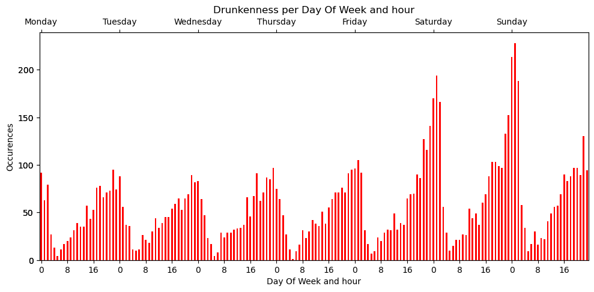

### **Drunkenness per day of week and hour**

On this page, we investigate the crime pattern of drunkenness over a week. This figure shows bar plots of drunkenness counts by day of the week and hour of the day.

The graph above shows the statistical value of drunkenness at which people were arrested for drunkenness on the appropriate day and time of the week. It is not difficult to find that the crime rate is always lowest before and after 4 a.m. every day. It then climbs until it peaks at midnight and then drops slightly.

It seems that people's body clocks are more excited and active in the evening, so they are more likely to drink heavily and get drunk when attending evening events. What’s worse, the evening is usually the peak time for social and entertainment activities, such as parties, nightclubs, bistros and so on. These occasions often involve drinking, so drunken behaviour is more common during these hours.

Besides, when the work week is over, people are always willing to relax when the weekend comes. Perhaps this is one of the essential reasons why the drunkenness of crime surges during the middle of the night on Friday and Saturday.
